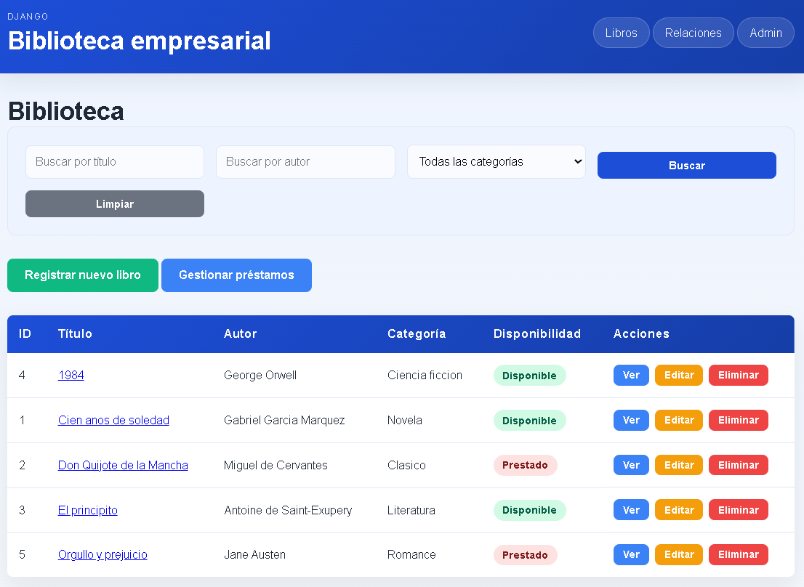

# Laboratorio Semana 4 - Relaciones entre modelos en Django

Aplicación web para administrar una biblioteca utilizando Django 5, Python,
SQLite, HTML y CSS. Esta versión implementa relaciones entre modelos mediante
el ORM de Django y conserva el CRUD de libros.

## Información general

**Curso:** Desarrollo de Aplicaciones Empresariales <br>
**Integrantes:** Gonzalo Davila y Pedro Suarez  
**Laboratorio:** 02 — Clases, atributos y métodos  
**Tecnología:** Python 3.10+, Django 5, Visual Studio Code y GitHub  
**Problemática:** Consulta y registro de libros de una biblioteca.

# PROGRAMA EN FUNCIONAMIENTO



## Objetivo

Implementar relaciones 1:1, 1:N y N:M en la aplicación `library`, incluyendo
un modelo intermedio con atributos propios, consultas optimizadas, migraciones,
CRUD y administración desde Django Admin.

## Instalación y ejecución

Desde la carpeta raíz del proyecto:

```powershell
cd src
..\.venv\Scripts\Activate.ps1
python -m pip install -r ..\requirements.txt
python manage.py migrate
python manage.py runserver
```

Aplicación: <http://127.0.0.1:8000/library/>

Panel administrativo: <http://127.0.0.1:8000/admin/>

## Crear usuario administrador

La base de datos no contiene una contraseña predeterminada. Crear un usuario
administrador con:

```powershell
python manage.py createsuperuser
```

El comando solicitará nombre de usuario, correo electrónico y contraseña.
Para cambiar la contraseña posteriormente:

```powershell
python manage.py changepassword <usuario>
```

Las credenciales son locales y no deben guardarse en el repositorio.

## Modelos

### `Libro`

Modelo principal de la biblioteca. Contiene título, autor, categoría,
disponibilidad, editorial y socios relacionados mediante préstamos.

### `Editorial`

Representa la editorial de uno o varios libros.

### `Socio`

Representa a una persona que puede solicitar libros prestados.

### `FichaLibro`

Extiende la información de un libro con resumen y ubicación física.

### `Prestamo`

Modelo intermedio entre `Libro` y `Socio`. Contiene:

- `fecha_prestamo`
- `fecha_devolucion`
- `estado`

## Relaciones implementadas

### Relación 1:1

`Libro` tiene una única `FichaLibro` mediante `OneToOneField`:

```python
libro = models.OneToOneField(
    Libro,
    on_delete=models.CASCADE,
    related_name="ficha",
)
```

La ficha depende del libro, por eso se utiliza `CASCADE`.

### Relación 1:N

Una `Editorial` puede tener varios `Libro` mediante `ForeignKey`:

```python
editorial = models.ForeignKey(
    Editorial,
    on_delete=models.SET_NULL,
    null=True,
    blank=True,
    related_name="libros",
)
```

Se utiliza `SET_NULL` para conservar los libros si se elimina una editorial.
Los libros se consultan desde una editorial con `editorial.libros.all()`.

### Relación N:M

Un `Libro` puede relacionarse con varios `Socio` y un socio puede tener varios
libros. La relación utiliza el modelo intermedio `Prestamo`:

```python
socios = models.ManyToManyField(
    Socio,
    through="Prestamo",
    related_name="libros",
)
```

## Consultas optimizadas

La vista `/library/relaciones/select/` utiliza:

```python
Libro.objects.select_related("editorial", "ficha").all()
```

La vista `/library/relaciones/prefetch/` utiliza:

```python
Libro.objects.prefetch_related(
    "socios",
    "prestamos__socio",
).all()
```

Las relaciones se muestran directamente en los templates de la aplicación.

## CRUD del modelo intermedio

El modelo `Prestamo` cuenta con formulario `ModelForm` y operaciones CRUD:

| Operación | URL |
|---|---|
| Listar | `/library/relaciones/` |
| Crear | `/library/relaciones/crear/` |
| Editar | `/library/relaciones/editar/<id>/` |
| Eliminar | `/library/relaciones/eliminar/<id>/` |

## URLs principales

| Funcionalidad | URL |
|---|---|
| Lista de libros | `/library/` |
| Crear libro | `/library/crear/` |
| Detalle de libro | `/library/<id>/` |
| Editar libro | `/library/<id>/editar/` |
| Eliminar libro | `/library/<id>/eliminar/` |
| Consulta con `select_related` | `/library/relaciones/select/` |
| Consulta con `prefetch_related` | `/library/relaciones/prefetch/` |
| CRUD de préstamos | `/library/relaciones/` |
| Admin | `/admin/` |

## Migraciones

Las migraciones de Semana 4 son:

- `0003_editorial_socio_libro_editorial_fichalibro_prestamo_and_more`: crea
  las entidades y relaciones.
- `0004_datos_relaciones_iniciales`: carga datos de demostración sin borrar
  datos existentes.

Comandos de verificación:

```powershell
cd src
python manage.py makemigrations
python manage.py migrate
python manage.py showmigrations
```

## Datos de demostración

La migración `0004` crea editoriales, socios, fichas de libros y préstamos de
ejemplo. Estos datos permiten comprobar las relaciones desde la aplicación y
desde el panel Admin.

## Estructura del proyecto

```text
MYDJANGO-main/
├── src/
│   ├── config/
│   ├── core/
│   ├── library/
│   │   ├── migrations/
│   │   ├── templates/library/
│   │   ├── admin.py
│   │   ├── forms.py
│   │   ├── models.py
│   │   ├── tests.py
│   │   ├── urls.py
│   │   └── views.py
│   └── manage.py
├── evidencias/
├── mydjango.md
├── README.md
└── requirements.txt
```

La aplicación principal del laboratorio es `library`. La aplicación `core`
se conserva porque todavía proporciona la plantilla base y rutas existentes.

## Flujo MVT

```text
Request -> URL -> View -> Model/ORM -> SQLite
        -> Context -> Template -> Response
```

## Validación

```powershell
cd src
python manage.py check
python manage.py makemigrations --check
python manage.py migrate
python manage.py showmigrations
python manage.py test
```

Resultado esperado: el sistema no debe reportar errores y todas las pruebas
deben finalizar correctamente.

## Evidencias

La carpeta `evidencias/` contiene la guía para capturar:

1. Modelos y relaciones reales.
2. Migraciones creadas y aplicadas.
3. Vista con `select_related()`.
4. Vista con `prefetch_related()`.
5. CRUD de `Prestamo`.
6. Modelos registrados en Django Admin.

No se incluyen capturas inventadas; deben tomarse con el servidor ejecutándose.
